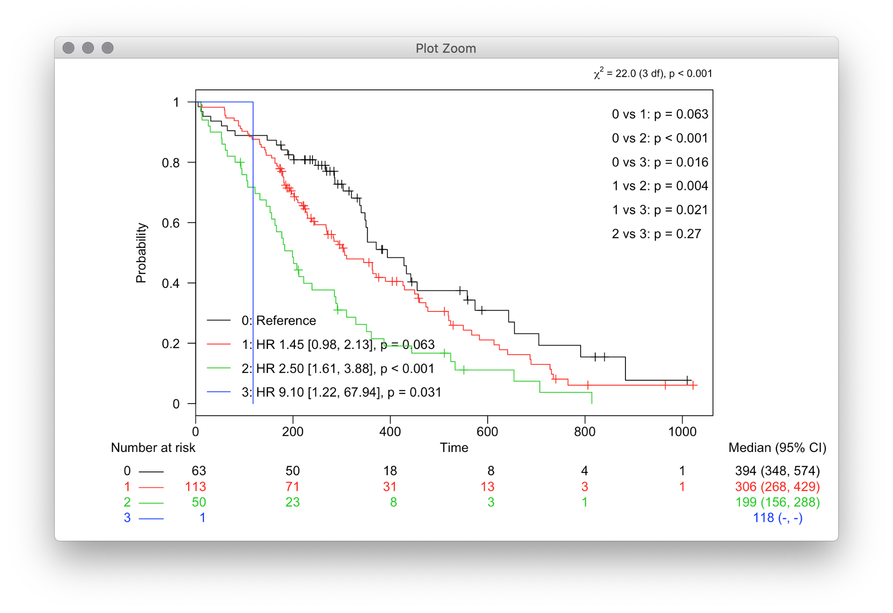
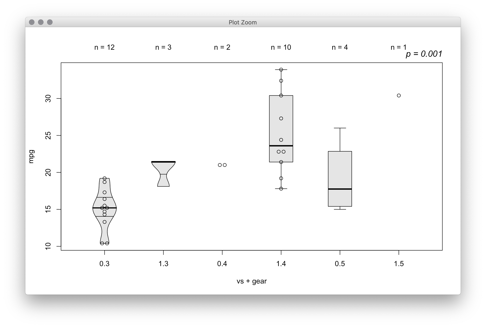
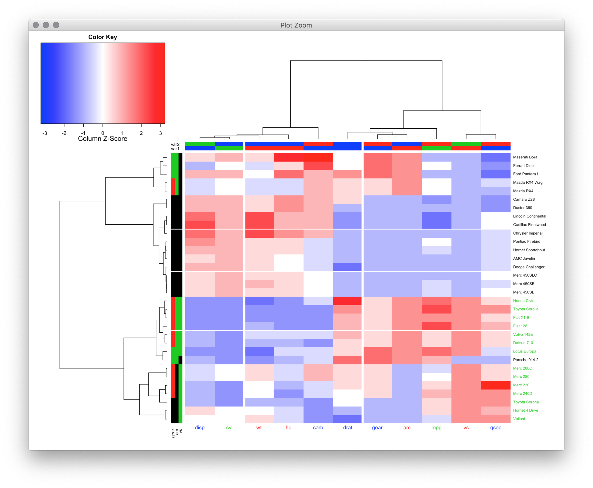
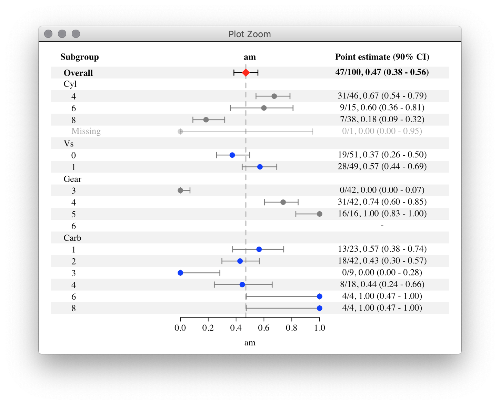

rawr
====

personal package with miscellaneous functions, stuff in progress, and tools I use regularly

to install:

```r
# install.packages('devtools')
devtools::install_github('raredd/rawr')
```

---

**some useful things for ...**


### survival analysis


**kaplan-meier with a whole bunch of extra junk**

```r
library('survival')
s <- survfit(Surv(time, status) ~ factor(ph.ecog), cancer)

kmplot(
  s,
  atrisk.col = TRUE, strata.lab = TRUE,
  median = TRUE, hr_text = TRUE, pw_test = TRUE
)
```



**convenience function for survival analysis**

```r
kmplot_by(
  'factor(ph.ecog)', time = 'time', event = 'status', cancer,
  tt_test = TRUE, by = 'sex', strata_lab = FALSE, atrisk.type = 'survival',
  atrisk.col = TRUE, median = TRUE, hr_text = TRUE, pw_test = TRUE
)
```


**get the pairwise differences easily**

```r
survdiff_pairs(s)
```

```
## $n
##     0   1  2  3
## 0  63  NA NA NA
## 1 176 113 NA NA
## 2 113 163 50 NA
## 3  64 114 51  1
## 
## $chi.sq
##           0        1       2  3
## 0        NA       NA      NA NA
## 1  3.456831       NA      NA NA
## 2 16.682328 8.433446      NA NA
## 3  5.779873 5.333335 1.24231 NA
## 
## $p.value
##           0         1         2         3
## 0        NA 0.1259819 0.0002651 0.0648429
## 1 0.0629909        NA 0.0184191 0.0648429
## 2 0.0000442 0.0036838        NA 0.2650263
## 3 0.0162107 0.0209213 0.2650263        NA
## 
## attr(,"class")
## [1] "survdiff_pairs"
```

**make a summary table**

```r
combine_table(
  surv_table(s),
  caption = 'Survival summary'
)
```

<table class='gmisc_table' style='border-collapse: collapse; margin-top: 1em; margin-bottom: 1em;' >
<thead>
<tr><td colspan='5' style='text-align: left;'>
Survival summary</td></tr>
<tr>
<th style='border-bottom: 1px solid grey; border-top: 2px solid grey; text-align: center;'>Time</th>
<th style='border-bottom: 1px solid grey; border-top: 2px solid grey; text-align: center;'>No. at risk</th>
<th style='border-bottom: 1px solid grey; border-top: 2px solid grey; text-align: center;'>No. event</th>
<th style='border-bottom: 1px solid grey; border-top: 2px solid grey; text-align: center;'>Std.Error</th>
<th style='border-bottom: 1px solid grey; border-top: 2px solid grey; text-align: center;'>Surv (95% CI)</th>
</tr>
</thead>
<tbody>
<tr><td colspan='5' style='font-weight: 900; text-align: left;'>factor(ph.ecog)=0</td></tr>
<tr>
<td style='text-align: center;'>0</td>
<td style='text-align: center;'>63</td>
<td style='text-align: center;'>0</td>
<td style='text-align: center;'>0.000</td>
<td style='text-align: center;'>1.000 (1.000, 1.000)</td>
</tr>
<tr>
<td style='text-align: center;'>200</td>
<td style='text-align: center;'>50</td>
<td style='text-align: center;'>11</td>
<td style='text-align: center;'>0.048</td>
<td style='text-align: center;'>0.825 (0.736, 0.924)</td>
</tr>
<tr>
<td style='text-align: center;'>400</td>
<td style='text-align: center;'>18</td>
<td style='text-align: center;'>15</td>
<td style='text-align: center;'>0.074</td>
<td style='text-align: center;'>0.484 (0.358, 0.654)</td>
</tr>
<tr>
<td style='text-align: center;'>600</td>
<td style='text-align: center;'>8</td>
<td style='text-align: center;'>6</td>
<td style='text-align: center;'>0.075</td>
<td style='text-align: center;'>0.309 (0.192, 0.497)</td>
</tr>
<tr>
<td style='text-align: center;'>800</td>
<td style='text-align: center;'>4</td>
<td style='text-align: center;'>4</td>
<td style='text-align: center;'>0.066</td>
<td style='text-align: center;'>0.154 (0.067, 0.358)</td>
</tr>
<tr>
<td style='text-align: center;'>1000</td>
<td style='text-align: center;'>1</td>
<td style='text-align: center;'>1</td>
<td style='text-align: center;'>0.064</td>
<td style='text-align: center;'>0.077 (0.015, 0.391)</td>
</tr>
<tr><td colspan='5' style='font-weight: 900; text-align: left; border-top: 1px solid #BEBEBE;'>factor(ph.ecog)=1</td></tr>
<tr>
<td style='text-align: center;'>0</td>
<td style='text-align: center;'>113</td>
<td style='text-align: center;'>0</td>
<td style='text-align: center;'>0.000</td>
<td style='text-align: center;'>1.000 (1.000, 1.000)</td>
</tr>
<tr>
<td style='text-align: center;'>200</td>
<td style='text-align: center;'>71</td>
<td style='text-align: center;'>34</td>
<td style='text-align: center;'>0.044</td>
<td style='text-align: center;'>0.695 (0.615, 0.786)</td>
</tr>
<tr>
<td style='text-align: center;'>400</td>
<td style='text-align: center;'>31</td>
<td style='text-align: center;'>26</td>
<td style='text-align: center;'>0.051</td>
<td style='text-align: center;'>0.405 (0.316, 0.518)</td>
</tr>
<tr>
<td style='text-align: center;'>600</td>
<td style='text-align: center;'>13</td>
<td style='text-align: center;'>13</td>
<td style='text-align: center;'>0.047</td>
<td style='text-align: center;'>0.211 (0.136, 0.328)</td>
</tr>
<tr>
<td style='text-align: center;'>800</td>
<td style='text-align: center;'>3</td>
<td style='text-align: center;'>9</td>
<td style='text-align: center;'>0.031</td>
<td style='text-align: center;'>0.061 (0.023, 0.164)</td>
</tr>
<tr>
<td style='text-align: center;'>1000</td>
<td style='text-align: center;'>1</td>
<td style='text-align: center;'>0</td>
<td style='text-align: center;'>0.031</td>
<td style='text-align: center;'>0.061 (0.023, 0.164)</td>
</tr>
<tr><td colspan='5' style='font-weight: 900; text-align: left; border-top: 1px solid #BEBEBE;'>factor(ph.ecog)=2</td></tr>
<tr>
<td style='text-align: center;'>0</td>
<td style='text-align: center;'>50</td>
<td style='text-align: center;'>0</td>
<td style='text-align: center;'>0.000</td>
<td style='text-align: center;'>1.000 (1.000, 1.000)</td>
</tr>
<tr>
<td style='text-align: center;'>200</td>
<td style='text-align: center;'>23</td>
<td style='text-align: center;'>25</td>
<td style='text-align: center;'>0.072</td>
<td style='text-align: center;'>0.485 (0.363, 0.649)</td>
</tr>
<tr>
<td style='text-align: center;'>400</td>
<td style='text-align: center;'>8</td>
<td style='text-align: center;'>13</td>
<td style='text-align: center;'>0.059</td>
<td style='text-align: center;'>0.191 (0.104, 0.350)</td>
</tr>
<tr>
<td style='text-align: center;'>600</td>
<td style='text-align: center;'>3</td>
<td style='text-align: center;'>3</td>
<td style='text-align: center;'>0.049</td>
<td style='text-align: center;'>0.111 (0.047, 0.266)</td>
</tr>
<tr>
<td style='text-align: center;'>800</td>
<td style='text-align: center;'>1</td>
<td style='text-align: center;'>2</td>
<td style='text-align: center;'>0.034</td>
<td style='text-align: center;'>0.037 (0.006, 0.229)</td>
</tr>
<tr><td colspan='5' style='font-weight: 900; text-align: left; border-top: 1px solid #BEBEBE;'>factor(ph.ecog)=3</td></tr>
<tr>
<td style='border-bottom: 2px solid grey; text-align: center;'>0</td>
<td style='border-bottom: 2px solid grey; text-align: center;'>1</td>
<td style='border-bottom: 2px solid grey; text-align: center;'>0</td>
<td style='border-bottom: 2px solid grey; text-align: center;'>0.000</td>
<td style='border-bottom: 2px solid grey; text-align: center;'>1.000 (1.000, 1.000)</td>
</tr>
</tbody>
</table>

### misc plots

**box plot + violin plot + dot plot + testing + ...**


```r
tplot(
  mpg ~ vs + gear, mtcars, test = TRUE,
  type = c('dv', 'v', 'd', 'db', 'b', 'd'),
  ## options for violin plots
  quantiles = c(0.25, 0.5, 0.75), lwd = c(1, 2.5, 1)
)
```



**heatmap + row/column matrices + formatting**


```r
x <- scale(as.matrix(mtcars))

## row and column colors
rc <- cbind(gear = x[, 'gear'], am = x[, 'am'], vs = x[, 'vs'])
rc[] <- palette()[rc + 2L]

cc <- rbind(var1 = nchar(colnames(x)), var2 = nchar(sort(colnames(x))))
cc[] <- palette()[cc]

heatmap.3(
  x, scale = 'column', distfun = 'spearman', hclustfun = 'ward.D2',
  RowSideColors = rc, ColSideColors = cc,
  labRowCol = rc[, 3], labColCol = cc[1, ],
  margins = c(5, 10),
  colsep = c(2, 6), rowsep = c(9, 14, 21), sepwidth = c(5, 2)
)
```



**binomial CI forest plot**


```r
dat <- mtcars[sample(nrow(mtcars), 100L, TRUE), ]
dat[1, 2] <- NA
vv  <- c('cyl', 'vs', 'gear', 'carb')
dat$gear <- factor(dat$gear, 3:6)

bplot(
  dat, setNames(vv, case(vv)), 'am',
  col = c('red', 'grey50', 'blue', 'grey50', 'blue'),
  conf = 0.9, alpha_missing = 0.4
)
```



### stat things

**tests for doubly- (jonckheere-terpstra) or singly-ordered (kruskal-wallis) tables**


```r
tbl <- table(mtcars$gear, mtcars$cyl)
# fisher.test(tbl)
jt.test(tbl)
```

```
## 
## 	Jonckheere-Terpstra Test
## 
## data:  tbl
## z = -3.1551, p-value = 0.001604
```

```r
kw.test(tbl, simulate.p.value = TRUE)
```

```
## 
## 	Test for equality of proportions without continuity correction with simulated p-value (based on 2000 replicates)
## 
## data:  tbl
## Kruskal-Wallis chi-squared = 16.722, df = 2, p-value < 2.2e-16
## 99 percent confidence interval:
##  0.000000000 0.002299936
```

**test for _ordered_ kruskal-wallis rank-sum**


```r
# kruskal.test(mpg ~ cyl, mtcars)
cuzick.test(mpg ~ cyl, mtcars)
```

```
## 
## 	Wilcoxon rank-sum test for trend in 3 ordered groups (corrected for ties)
## 
## data:  mpg by cyl
## z = -5.0741, p-value = 3.894e-07
## sample estimates:
## median of 4 (n=11)  median of 6 (n=7) median of 8 (n=14) 
##               26.0               19.7               15.2
```

### knitr/convenience things

**basically a table**


```r
tabler_by2(
  mtcars, c('gear', 'vs'), 'cyl',
  stratvar = 'am', n = table(mtcars$am),
  zeros = '-', pct = TRUE, pct.total = TRUE
)
```

```
##   vs  Total      Total      4         6         8          Total     4         6         8        
## 3 "0" "12 (38%)" "12 (63%)" "-"       "-"       "12 (63%)" "-"       "-"       "-"       "-"      
##   "1" "3 (9%)"   "3 (16%)"  "1 (5%)"  "2 (11%)" "-"        "-"       "-"       "-"       "-"      
## 4 "0" "2 (6%)"   "-"        "-"       "-"       "-"        "2 (15%)" "-"       "2 (15%)" "-"      
##   "1" "10 (31%)" "4 (21%)"  "2 (11%)" "2 (11%)" "-"        "6 (46%)" "6 (46%)" "-"       "-"      
## 5 "0" "4 (13%)"  "-"        "-"       "-"       "-"        "4 (31%)" "1 (8%)"  "1 (8%)"  "2 (15%)"
##   "1" "1 (3%)"   "-"        "-"       "-"       "-"        "1 (8%)"  "1 (8%)"  "-"       "-"
```

**basically a table**


```r
tabler_stat2(
  within(mtcars, cyl <- factor(cyl, ordered = TRUE)),
  c('Miles/gal' = 'mpg', 'Engine (V/S)' = 'vs', Cylinders = 'cyl'),
  c('# of gears' = 'gear'), correct = 'BH',
  htmlArgs = list(caption = 'Table 1.')
)
```

<table class='gmisc_table' style='border-collapse: collapse; margin-top: 1em; margin-bottom: 1em;' >
<thead>
<tr><td colspan='9' style='text-align: left;'>
Table 1.</td></tr>
<tr>
<th style='border-top: 2px solid grey;'></th>
<th colspan='1' style='font-weight: 900; border-top: 2px solid grey; text-align: center;'></th><th style='border-top: 2px solid grey;; border-bottom: hidden;'>&nbsp;</th>
<th colspan='3' style='font-weight: 900; border-bottom: 1px solid grey; border-top: 2px solid grey; text-align: center;'># of gears</th><th style='border-top: 2px solid grey;; border-bottom: hidden;'>&nbsp;</th>
<th colspan='2' style='font-weight: 900; border-top: 2px solid grey; text-align: center;'></th>
</tr>
<tr>
<th style='border-bottom: 1px solid grey;'> </th>
<th style='font-weight: 900; border-bottom: 1px solid grey; text-align: center;'>Total<br /><font weight=normal; size=1>n = 32 (%)</font></th>
<th style='font-weight: 900; border-bottom: 1px solid grey; text-align: center;' colspan='1'>&nbsp;</th>
<th style='font-weight: 900; border-bottom: 1px solid grey; text-align: center;'>3<br /><font weight=normal; size=1>n = 15 (47)</font></th>
<th style='font-weight: 900; border-bottom: 1px solid grey; text-align: center;'>4<br /><font weight=normal; size=1>n = 12 (38)</font></th>
<th style='font-weight: 900; border-bottom: 1px solid grey; text-align: center;'>5<br /><font weight=normal; size=1>n =  5 (16)</font></th>
<th style='font-weight: 900; border-bottom: 1px solid grey; text-align: center;' colspan='1'>&nbsp;</th>
<th style='font-weight: 900; border-bottom: 1px solid grey; text-align: center;'><em>p-value</em></th>
<th style='font-weight: 900; border-bottom: 1px solid grey; text-align: center;'><em>BH p-value</em></th>
</tr>
</thead>
<tbody> 
<tr><td colspan='9' style='padding: 0px 5px 0px; white-space: nowrap; font-weight: 900;'>Miles/gal</td></tr>
<tr>
<td style='padding: 0px 5px 0px; white-space: nowrap; text-align: left;'>&nbsp;&nbsp;Median (range)</td>
<td style='padding: 0px 5px 0px; white-space: nowrap; text-align: center;'>19.2 (10.4 - 33.9)</td>
<td style='padding: 0px 5px 0px; white-space: nowrap; text-align: center;' colspan='1'>&nbsp;</td>
<td style='padding: 0px 5px 0px; white-space: nowrap; text-align: center;'>15.5 (10.4 - 21.5)</td>
<td style='padding: 0px 5px 0px; white-space: nowrap; text-align: center;'>22.8 (17.8 - 33.9)</td>
<td style='padding: 0px 5px 0px; white-space: nowrap; text-align: center;'>19.7 (15.0 - 30.4)</td>
<td style='padding: 0px 5px 0px; white-space: nowrap; text-align: center;' colspan='1'>&nbsp;</td>
<td style='padding: 0px 5px 0px; white-space: nowrap; text-align: center;'><em><font color="#DF536B">&lt; 0.001</font></em><sup>&#94;</sup></td>
<td style='padding: 0px 5px 0px; white-space: nowrap; text-align: center;'><font color="#DF536B">0.002</font></td>
</tr> 
<tr><td colspan='9' style='padding: 0px 5px 0px; white-space: nowrap; font-weight: 900;'>Engine (V/S)</td></tr>
<tr>
<td style='padding: 0px 5px 0px; white-space: nowrap; text-align: left;'>&nbsp;&nbsp;Median (range)</td>
<td style='padding: 0px 5px 0px; white-space: nowrap; text-align: center;'>0 (0 - 1)</td>
<td style='padding: 0px 5px 0px; white-space: nowrap; text-align: center;' colspan='1'>&nbsp;</td>
<td style='padding: 0px 5px 0px; white-space: nowrap; text-align: center;'>0 (0 - 1)</td>
<td style='padding: 0px 5px 0px; white-space: nowrap; text-align: center;'>1 (0 - 1)</td>
<td style='padding: 0px 5px 0px; white-space: nowrap; text-align: center;'>0 (0 - 1)</td>
<td style='padding: 0px 5px 0px; white-space: nowrap; text-align: center;' colspan='1'>&nbsp;</td>
<td style='padding: 0px 5px 0px; white-space: nowrap; text-align: center;'><em><font color="#DF536B">0.001</font></em><sup>&Dagger;</sup></td>
<td style='padding: 0px 5px 0px; white-space: nowrap; text-align: center;'><font color="#DF536B">0.002</font></td>
</tr> 
<tr><td colspan='9' style='padding: 0px 5px 0px; white-space: nowrap; font-weight: 900;'>Cylinders</td></tr>
<tr>
<td style='padding: 0px 5px 0px; white-space: nowrap; text-align: left;'>&nbsp;&nbsp;4</td>
<td style='padding: 0px 5px 0px; white-space: nowrap; text-align: center;'>11 (34)</td>
<td style='padding: 0px 5px 0px; white-space: nowrap; text-align: center;' colspan='1'>&nbsp;</td>
<td style='padding: 0px 5px 0px; white-space: nowrap; text-align: center;'>1 (7)</td>
<td style='padding: 0px 5px 0px; white-space: nowrap; text-align: center;'>8 (67)</td>
<td style='padding: 0px 5px 0px; white-space: nowrap; text-align: center;'>2 (40)</td>
<td style='padding: 0px 5px 0px; white-space: nowrap; text-align: center;' colspan='1'>&nbsp;</td>
<td style='padding: 0px 5px 0px; white-space: nowrap; text-align: center;'><em><font color="#DF536B">0.006</font></em><sup>&sect;</sup></td>
<td style='padding: 0px 5px 0px; white-space: nowrap; text-align: center;'><font color="#DF536B">0.006</font></td>
</tr>
<tr>
<td style='padding: 0px 5px 0px; white-space: nowrap; text-align: left;'>&nbsp;&nbsp;6</td>
<td style='padding: 0px 5px 0px; white-space: nowrap; text-align: center;'>7 (22)</td>
<td style='padding: 0px 5px 0px; white-space: nowrap; text-align: center;' colspan='1'>&nbsp;</td>
<td style='padding: 0px 5px 0px; white-space: nowrap; text-align: center;'>2 (13)</td>
<td style='padding: 0px 5px 0px; white-space: nowrap; text-align: center;'>4 (33)</td>
<td style='padding: 0px 5px 0px; white-space: nowrap; text-align: center;'>1 (20)</td>
<td style='padding: 0px 5px 0px; white-space: nowrap; text-align: center;' colspan='1'>&nbsp;</td>
<td style='padding: 0px 5px 0px; white-space: nowrap; text-align: center;'></td>
<td style='padding: 0px 5px 0px; white-space: nowrap; text-align: center;'></td>
</tr>
<tr>
<td style='padding: 0px 5px 0px; white-space: nowrap; border-bottom: 2px solid grey; text-align: left;'>&nbsp;&nbsp;8</td>
<td style='padding: 0px 5px 0px; white-space: nowrap; border-bottom: 2px solid grey; text-align: center;'>14 (44)</td>
<td style='padding: 0px 5px 0px; white-space: nowrap; border-bottom: 2px solid grey; text-align: center;' colspan='1'>&nbsp;</td>
<td style='padding: 0px 5px 0px; white-space: nowrap; border-bottom: 2px solid grey; text-align: center;'>12 (80)</td>
<td style='padding: 0px 5px 0px; white-space: nowrap; border-bottom: 2px solid grey; text-align: center;'>-</td>
<td style='padding: 0px 5px 0px; white-space: nowrap; border-bottom: 2px solid grey; text-align: center;'>2 (40)</td>
<td style='padding: 0px 5px 0px; white-space: nowrap; border-bottom: 2px solid grey; text-align: center;' colspan='1'>&nbsp;</td>
<td style='padding: 0px 5px 0px; white-space: nowrap; border-bottom: 2px solid grey; text-align: center;'></td>
<td style='padding: 0px 5px 0px; white-space: nowrap; border-bottom: 2px solid grey; text-align: center;'></td>
</tr>
</tbody>
<tfoot><tr><td colspan='9'>
<font size=1><sup>&#94;</sup>Kruskal-Wallis rank-sum test, <sup>&Dagger;</sup>Fisher's exact test, <sup>&sect;</sup>Test for trend in proportions</font></td></tr></tfoot>
</table>

**a table, basically**


```r
set.seed(1)
r <- c('CR', 'PR', 'SD', 'PD', 'NE')
x <- factor(sample(r, 30, replace = TRUE), r)

table(x)
```

```
## x
## CR PR SD PD NE 
##  8  8  4  3  7
```

```r
t(t(tabler_resp(x, 3:1)))
```

```
##              [,1]                           
## CR           "8/30, 27% (95% CI: 12 - 46%)" 
## PR           "8/30, 27% (95% CI: 12 - 46%)" 
## SD           "4/30, 13% (95% CI: 4 - 31%)"  
## PD           "3/30, 10% (95% CI: 2 - 27%)"  
## NE           "7/30, 23% (95% CI: 10 - 42%)" 
## SD or better "20/30, 67% (95% CI: 47 - 83%)"
## PR or better "16/30, 53% (95% CI: 34 - 72%)"
## CR or better "8/30, 27% (95% CI: 12 - 46%)"
```

**in-line convenience functions**


```r
intr(mtcars$mpg)
intr(mtcars$mpg, conf = 0.95)

countr(mtcars$cyl)
countr(table(mtcars$vs), frac = TRUE)
```

```
## [1] "19 (range: 10 - 34)"
## [1] "19 (95% CI: 10 - 33)"
## [1] "4 (n = 11, 34%), 6 (n = 7, 22%), and 8 (n = 14, 44%)"
## [1] "0 (n = 18/32, 56%) and 1 (n = 14/32, 44%)"
```

for survival analysis


```r
surv_median(s)
surv_median(s, ci = TRUE)

surv_prob(s)
surv_prob(s, times = c(1, 3) * 100, ci = TRUE)

## unexported but useful (log-rank, pair-wise log-rank, tarone trend, wald)
rawr:::lr_pval(s)
rawr:::pw_pval(s)
rawr:::tt_pval(s)
rawr:::hr_pval(s)
```

```
## [1] "394, 306, 199, and 118"
## [1] "394 (95% CI: 348 - 574), 306 (95% CI: 268 - 429), 199 (95% CI: 156 - 288), and 118 (95% CI: NR - NR)"
## [1] "1.00, 0.82, 0.48, 0.31, 0.15, and 0.08"
## [1] "0.89 (95% CI: 0.81 - 0.97) and 0.73 (95% CI: 0.62 - 0.85)"
## [1] 6.642535e-05
##       0 vs 1       0 vs 2       0 vs 3       1 vs 2       1 vs 3       2 vs 3 
## 0.0629909491 0.0000441907 0.0162107154 0.0036838149 0.0209213160 0.2650263152 
## [1] 2.772269e-06
## factor(ph.ecog)1 factor(ph.ecog)2 factor(ph.ecog)3 
##     6.335907e-02     4.483837e-05     3.136764e-02
```

stats


```r
binconr(25, 50)
binconr(25, 50, show_conf = FALSE, frac = TRUE, percent = FALSE)

## length 2 vectors assume two-stage confidence intervals
binconr(c(10, 25), c(20, 30), show_conf = FALSE, frac = TRUE)


## p-values
pvalr(1e-3)
pvalr(1e-8, show.p = TRUE)
```

```
## [1] "50% (95% CI: 36 - 64%)"
## attr(,"method")
## [1] "exact"
## [1] "25/50, 0.50 (0.36 - 0.64)"
## attr(,"method")
## [1] "exact"
## [1] "25/50, 50% (29 - 73%)"
## attr(,"method")
## [1] "two-stage"
## [1] "0.001"
## [1] "p < 0.001"
```

in-line test summaries


```r
x <- mtcars$vs
y <- mtcars$am

# fisher.test(x, y)
inl_fisher(x, y)
inl_fisher(x, y, details = FALSE)

# chisq.test(table(x, y))
inl_chisq(x, y)
inl_chisq(x, y, details = FALSE)

# wilcox.test(mtcars$mpg ~ y)
inl_wilcox(mtcars$mpg, y)

# cuzick.test(mpg ~ gear, mtcars)
inl_cuzick(mtcars$mpg, mtcars$gear)

# jt.test(table(mtcars$gear, mtcars$cyl))
inl_jt(mtcars$gear, mtcars$cyl)

# ca.test(table(mtcars$vs, mtcars$cyl))
inl_ca(mtcars$vs, mtcars$cyl)
```

```
## [1] "OR: 1.96 (95% CI: 0.38 - 10.59), Fisher's exact p-value: 0.47"
## [1] "p = 0.47"
## [1] "&chi;<sup>2</sup>: 0.35 (1 df), chi-squared p-value: 0.56"
## [1] "p = 0.56"
## [1] "w: 42.00, Wilcoxon rank-sum p-value: 0.002"
## [1] "z: 2.69 (3 ordered groups), Cuzick trend p-value: 0.007"
## [1] "z: -3.16, Jonckheere-Terpstra p-value: 0.002"
## [1] "&chi;<sup>2</sup>: 21.04 (1 df), Cochran-Armitage p-value: < 0.001"
```

etc


```r
iprint(letters[1:3])
iprint(letters[1:3], copula = ' & ')

num2char(-5)
num2char(134)
```

```
## [1] "a, b, and c"
## [1] "a, b & c"
## [1] "Negative five"
## [1] "One hundred thirty-four"
```
